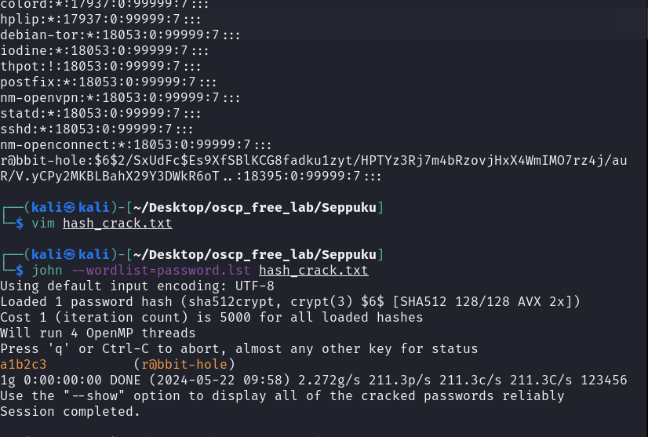

本系列為 Proving Grounds Play Free 靶機

題目難易度為 Easy

### nmap

很多坑的一題

發現 port `21,22,80,139,445,7080,7601,8088`

21 port 查找相關 Exploit 嘗試

7601 Port

使用 `dirb`

7601 port 發現 ckeditor

8808 port 發現為Web Console

卡關許多嘗試在改用其他工具重新掃描 dirsearch

80port 發現有`info.php`

7601 發現名為 secret

底下有個 password.lst

這邊又繼續踩了坑 有個名為`r@bbit-hole`的使用者,用john 解出 依然無法登入

嘗試 8088介面登入 以及 80 介面登入 最後想起有開SSH 可以直接登

進到系統後 會發現 cd 權限受限

僅需再輸入一次`bash` 即可

## 提權

進到 /var/www底下發現都為 root 沒可利用的點

使用`sudo -l` 看權限

發現無法利用

發現有個`.passwd`

查看/home底下使用者資料夾 跳至其他使用者

再次使用 `sudo -l` 

發現有可用/bin/ 但資料夾底下卻沒此資料夾

回到`/var/www/html` 底下查看有無目錄沒掃出來的資料夾

發現有個`keys`資料夾

查看內容 看起來是ssh key

使用 `ssh -i` 方式 來登入憑證

進到 tanto 使用者後

經過一陣嘗試 還是無效果

回頭想起使用者`samurai` sudo -l 可讀取`.cgi_bin/bin`

建立 `.cgi_bin`

但缺了一個 bin 執行檔 , 利用echo 產生,並附於權限

跳回至 `Samurai` 使用者  進行提權

總結..

很多坑跳很多使用者

手法都不難,但非常考驗耐心

知識點 : 

1. 使用至少兩種不同的目錄掃描器進行探勘
2. cd受限 再次使用bash
3. 跳至不同使用者查看 sudo -l
4. ssh -i 登入憑證

