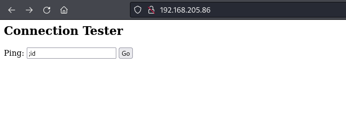
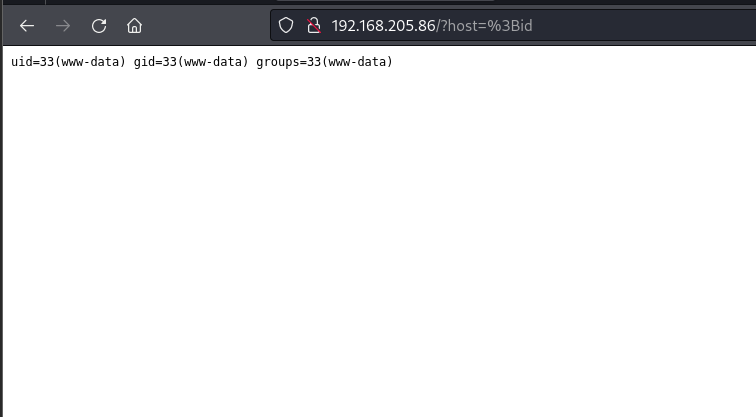
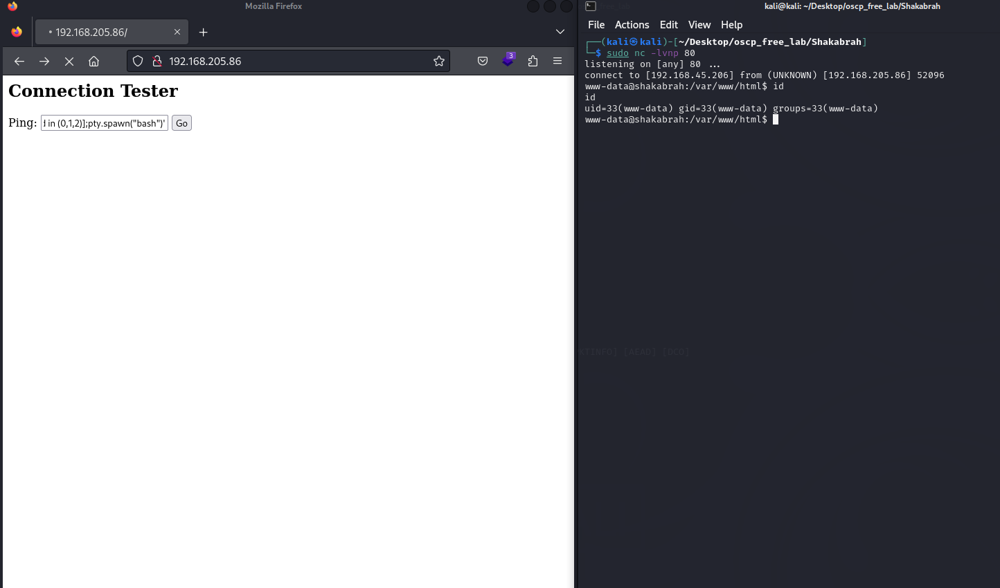
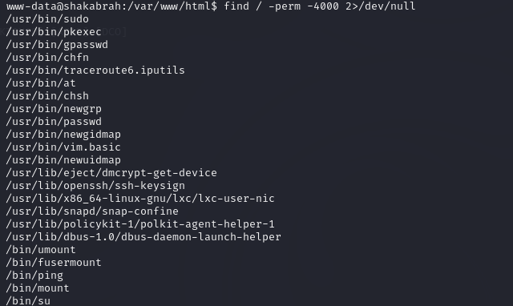

本系列為 Proving Grounds Play Free 靶機

題目難易度為 Easy

地雷 : 反彈 Port 有限制

擁有資訊

介面command injeciton

出現內容

直接revshell

這邊踩個雷,任何port 都無法進行反彈

嘗試 443 也不行,最終改為80 port才彈成功

查找SUID,發現有vim

## 進行提權

`/usr/bin/vim.basic -c ':py import os; os.execl("/bin/sh", "sh", "-c", "reset; exec sh")'`

總結 : 應為秒殺的題型,經驗不足被反彈 port 折騰許久