本系列為 Proving Grounds Play Free 靶機

官方難度 : Easy
社群評論難度 : INTERMEDIATE

## Port scan 發現 1337,3306 port

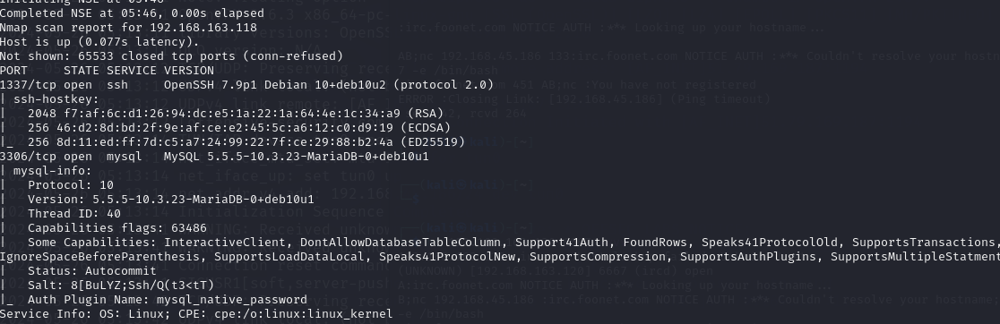

mysql 版本 5.5.5-10.3.23

已知資訊 發現 Auth Plugin Name : `mysql_native_password` 已知使用密碼

尋找nmap 掃描 mysql的枚舉方法

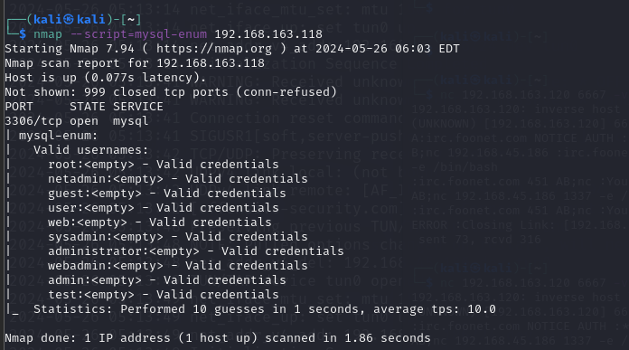

可發現有許多使用者名稱 

發現有開啟服務 可進行遠端連線

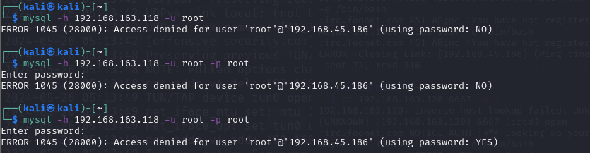

開啟 hydra 進行爆破

`hydra -L user.txt -P /usr/share/worlists/seclists/Password mysql://192.168.163.118`

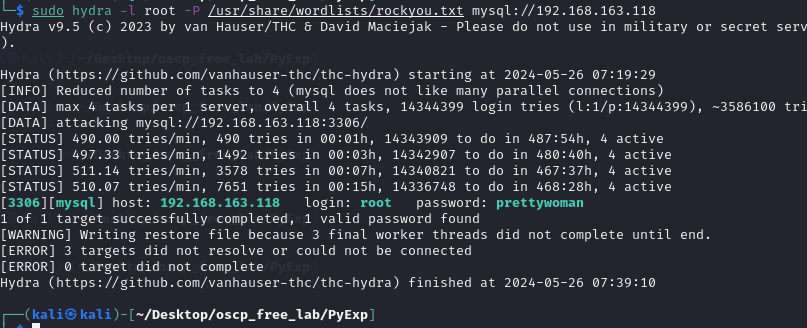

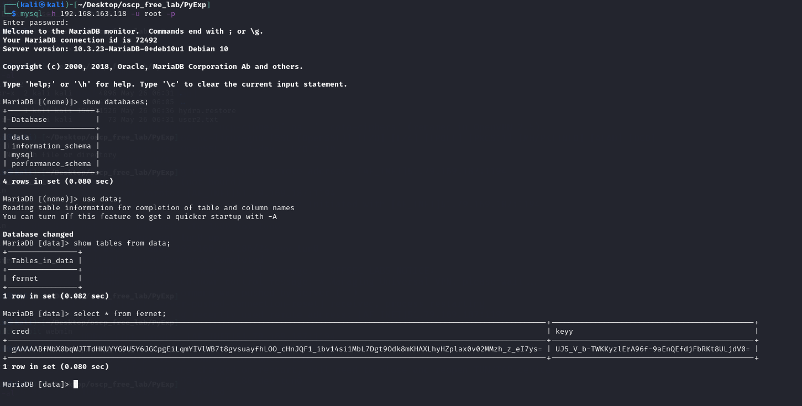

fernet table 資料

cred : 

`gAAAAABfMbX0bqWJTTdHKUYYG9U5Y6JGCpgEiLqmYIVlWB7t8gvsuayfhLOO_cHnJQF1_ibv14si1MbL7Dgt9Odk8mKHAXLhyHZplax0v02MMzh_z_eI7ys=`

keyy:

`UJ5_V_b-TWKKyzlErA96f-9aEnQEfdjFbRKt8ULjdV0=` 

利用 `gAAAAAB` 關鍵字丟上google 查詢到 可使用 python fetnet 模塊進行解碼

最後 找線上的fetnet 進行破解

得到的數據為 : 
```bash
lucy:wJ9`"Lemdv9[FEw-
```

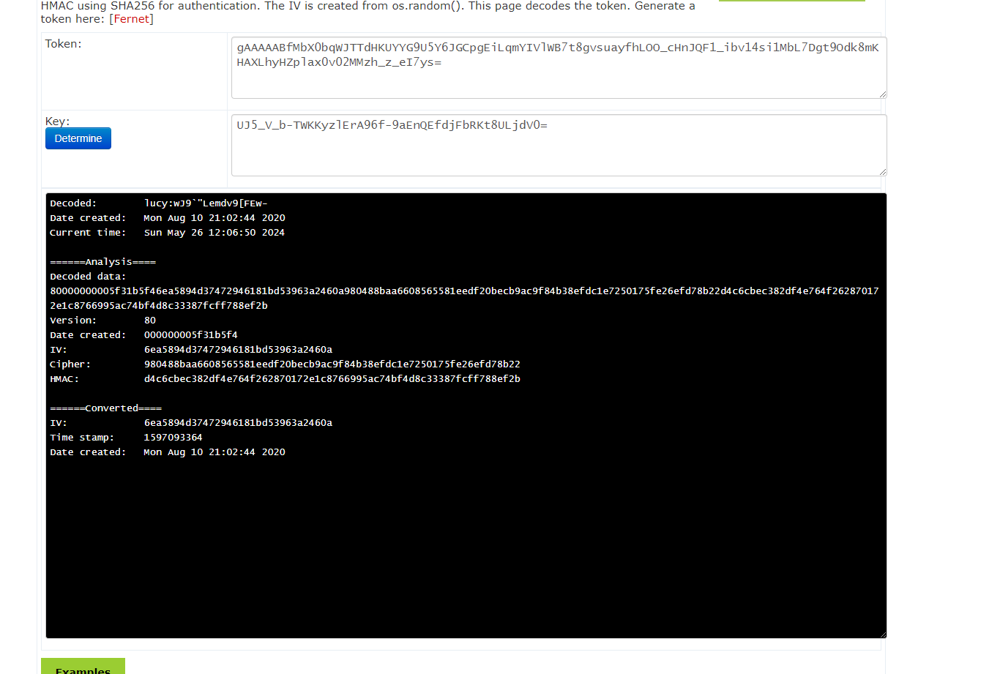

將密碼丟進字典檔 再次嘗試使用 hydra 進行破解

-s = 非預設port 

`hydra -L user2.txt -P /home/kali/Desktop/oscp_free_lab/PyExp/password.txt ssh://192.168.163.118 -s 1337`

依然無結果 最後看到帳號 密碼就已經在上方

```bash
lucy:wJ9`"Lemdv9[FEw-

user = lucy

password = wJ9`"Lemdv9[FEw-
```

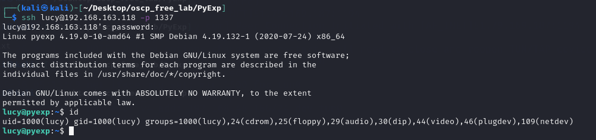

# 提權

使用 sudo -l

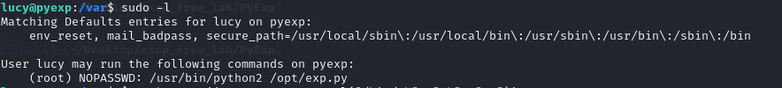

查看權限與內容

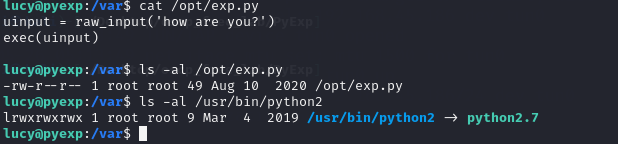

查看 SUID

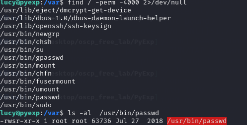

後續參考 將使用者直接寫入 /etc/passwod 發現沒有給於lucy寫入的權限

執行 exp.py 發現 他會執行exec

嘗試用他進行更改root密碼

`import os; cmd='sudo /usr/bin/passwd';os.system(cmd)`

顯示不能修改root

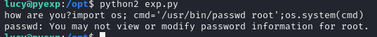

最後發現 掉進兔子洞裡面了

最後 加sudo 尋找 常見的 python 提權 即可 pwd

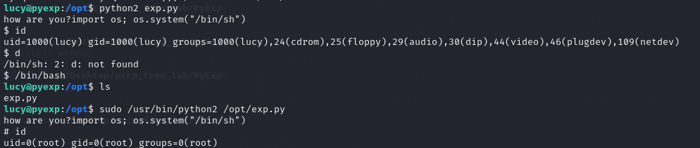