本系列為 Proving Grounds Play Free 靶機

官方難度 : Easy

社群認定難度 : Easy

知識點 : openssh key 權限必須為 600

### port Scan

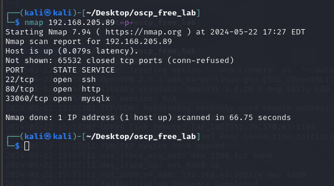

### 首頁

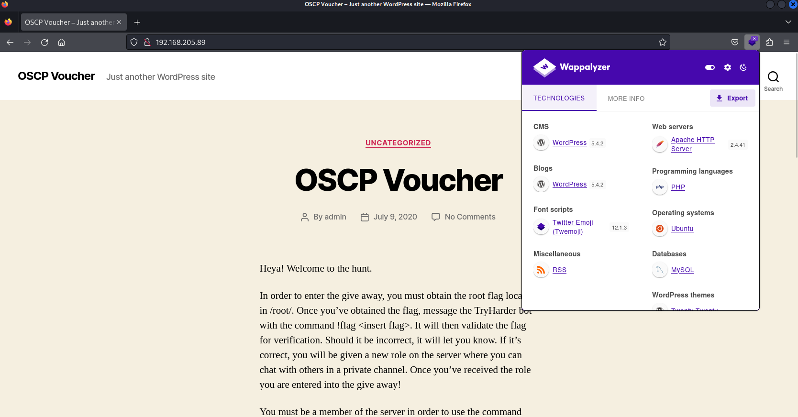

### 目錄爆破

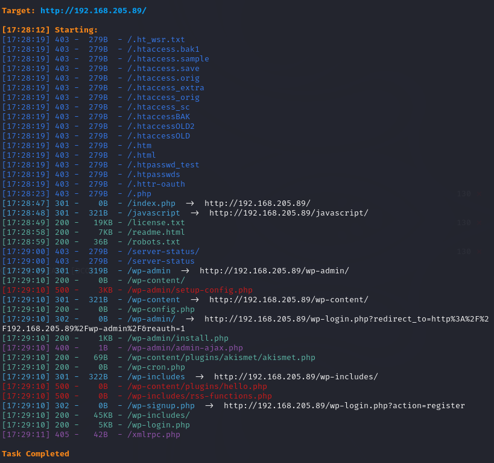

### Robots.txt

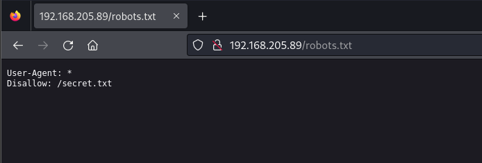

### secret.txt

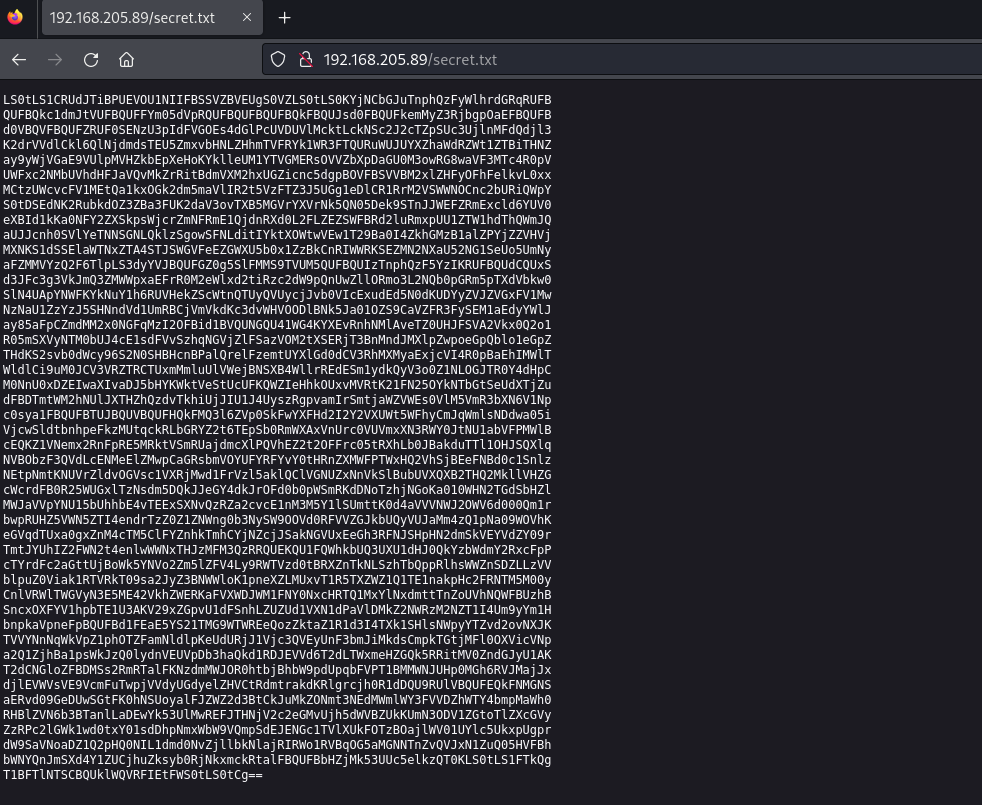

反解

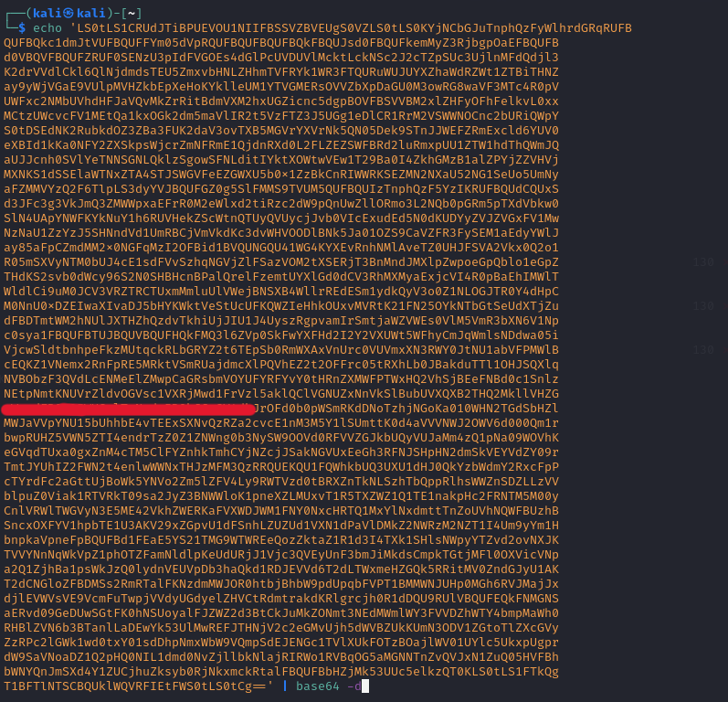

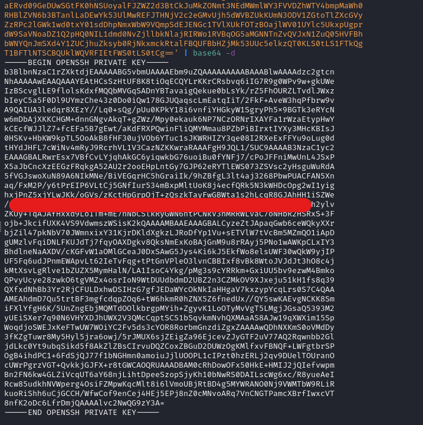

已知有SSH key 但不知道有哪些使用者

嘗試用 wpscan 來枚舉 wordpress 的使用者

使用者為 admin

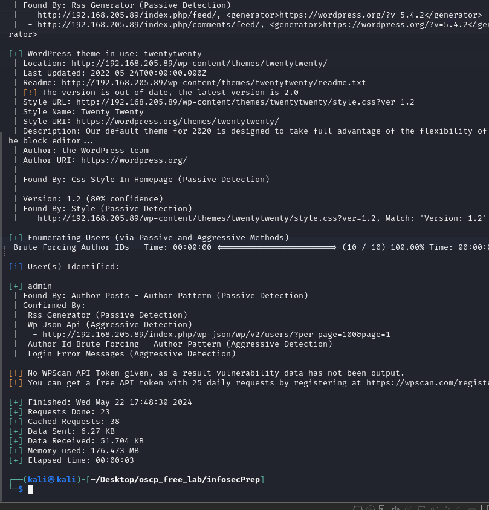

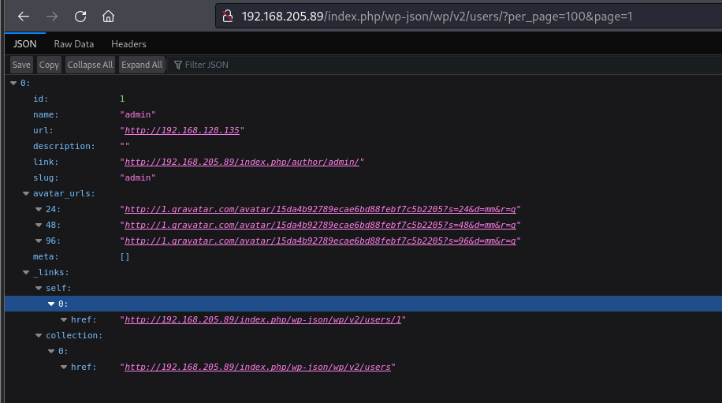

翻文章發現後 使用者為 oscp

嘗試用得到的 ssh key 進行登入

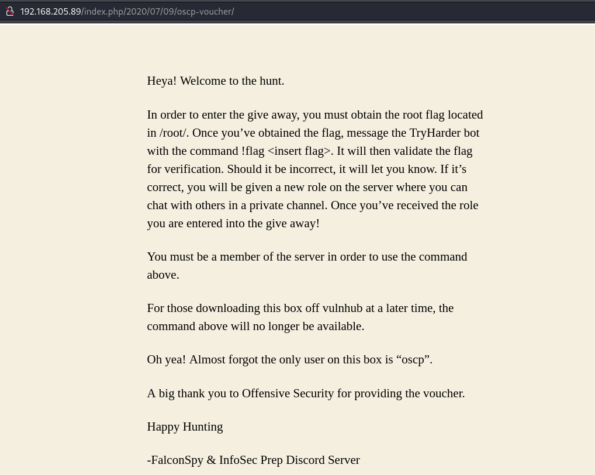

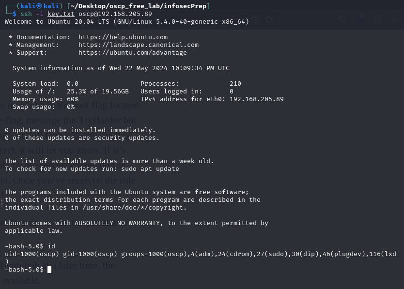

### 提權

發現有個名為 ip執行檔,但是為 root

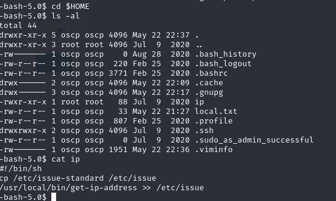

使用 grep 尋找 此程式有哪些地方在執行

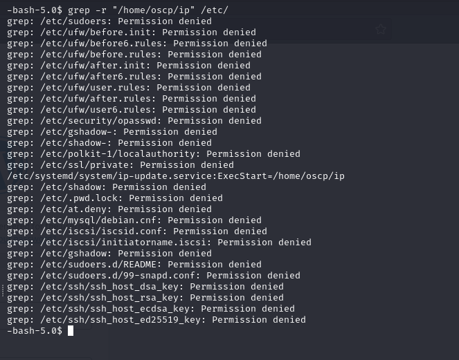

尋找具有root的程式

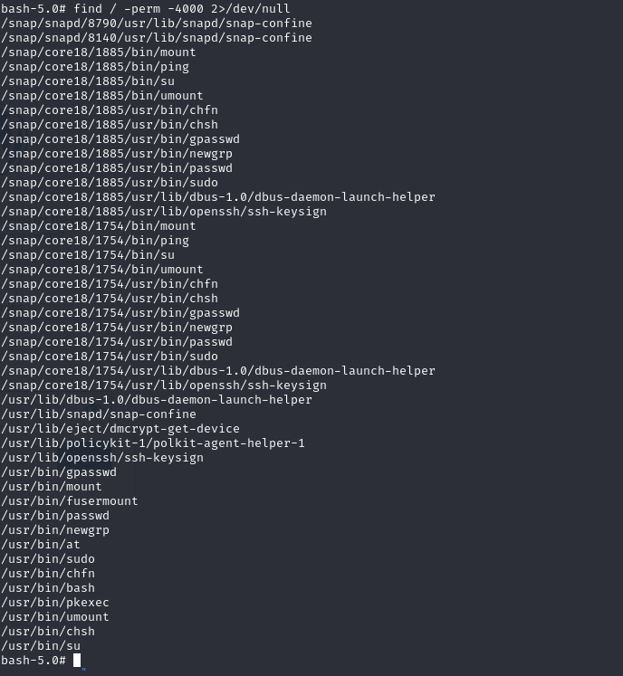

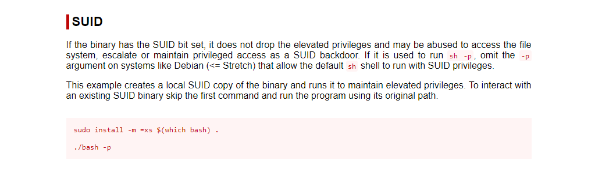

使用 `bash -p`

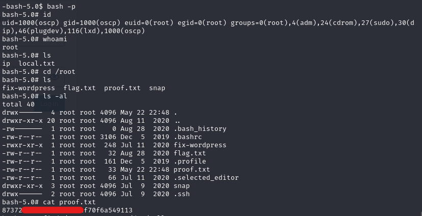