本系列為 Proving Grounds Play Subscription 靶機

## 官方難易度 : Easy

## 社群評論難易度 : Easy

## 知識點 :  SMTP RCE,提權不一定從權限,也有可能從洩漏的檔案

## Port Scan

```powershell
22,25,53,80,445
```

已知版本資訊

Samba smbd 4.7.6

Nginx 1.14.0

Flask BB

openSMTPD 2.0.0

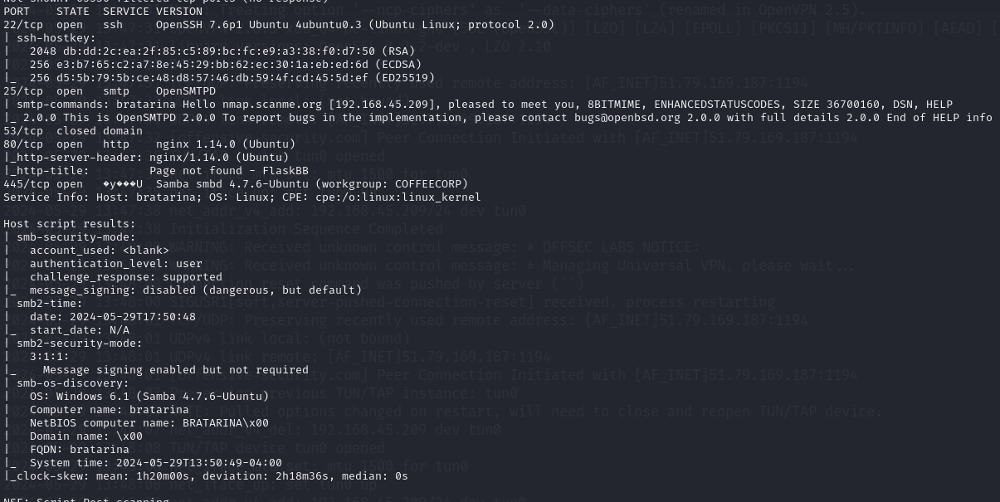

## 80 port

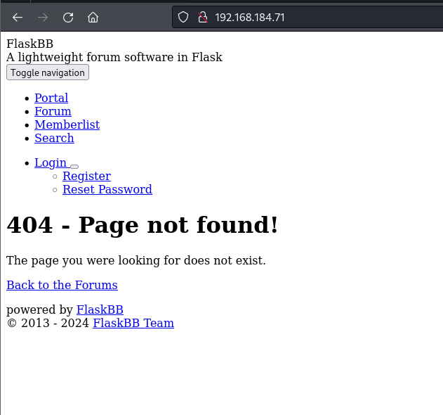

利用 FlaskBB 去Exploit-DB 找  發現只有2006年的漏洞

看到網頁最下方寫 2013-2024就放棄這條路

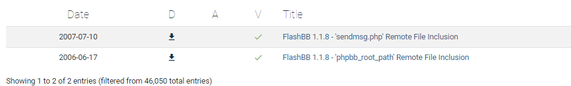

## 445 Port 枚舉

發現 Domain 

`BRATARINA`

`Builtin`

發現 STMP 使用者 `neil`

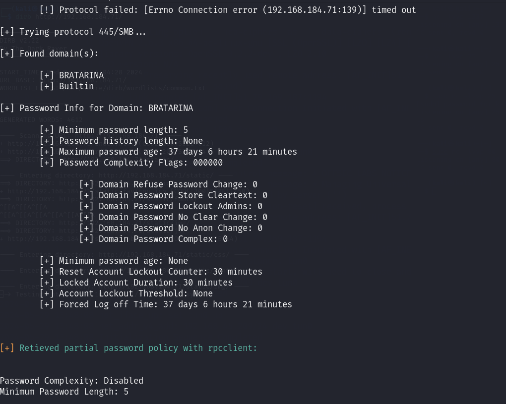

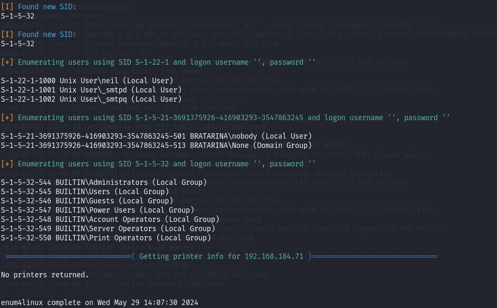

發現 25 Port 有**`OpenSMTPD`** CVE 可以嘗試利用 

嘗試了一會發現打不進去

查看了writeup 發現有許多小 trick

發現只有 有開啟的 port 才可成功讀取 (25,80,445)

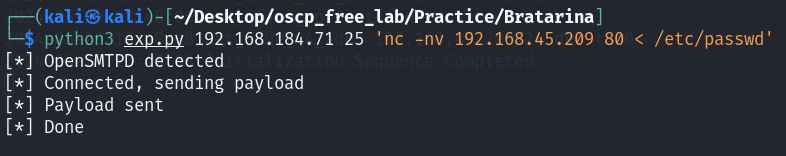

可讀檔後 開始寫檔案 覆蓋`/etc/passwd`

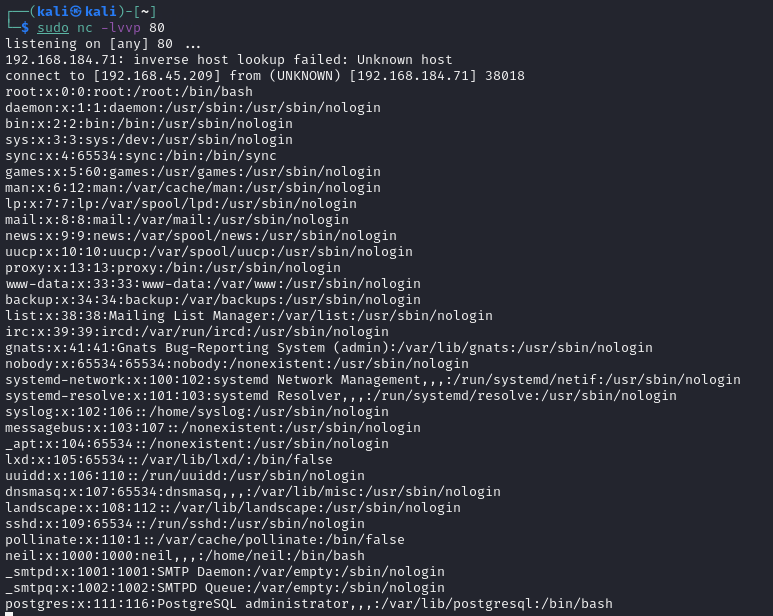

使用 `mkpasswd --method=MD5 --stdin` 

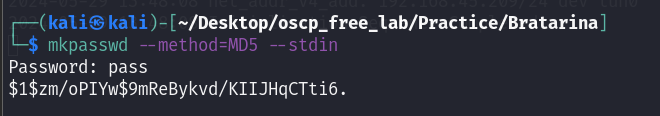

可準備一個已經寫好的root 密碼 常駐用來改後續`/etc/passwd`

`hacker:$1$hacker$zVnrpoW2JQO5YUrLmAs.o1:0:0:root:/root:/bin/bash`

使用到的工具

`mkpasswd` 

將稍早讀取到的 /etc/passwd 回到本機 copy一份 並改寫root權限 再丟回機器

---

另一解法

發現 445 Port 

使用 smbclient  發現 有檔案後 直接 metasploit

有個要注意的點

LHOST 預設為4444 須改為 稍早提到的 有開啟的 port 如 25,80,445

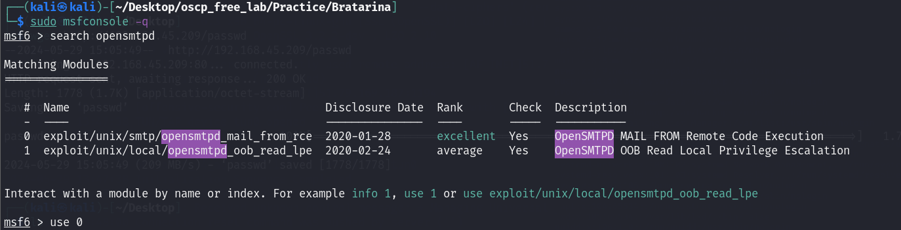

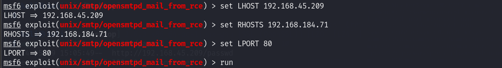

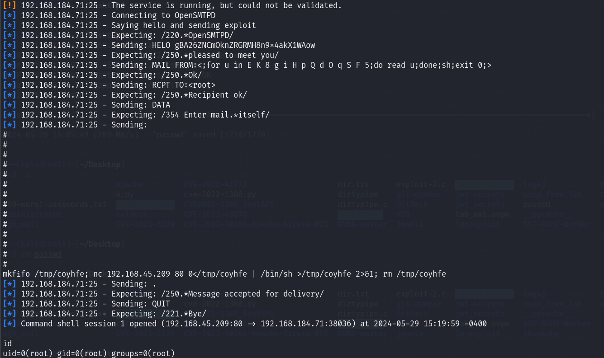