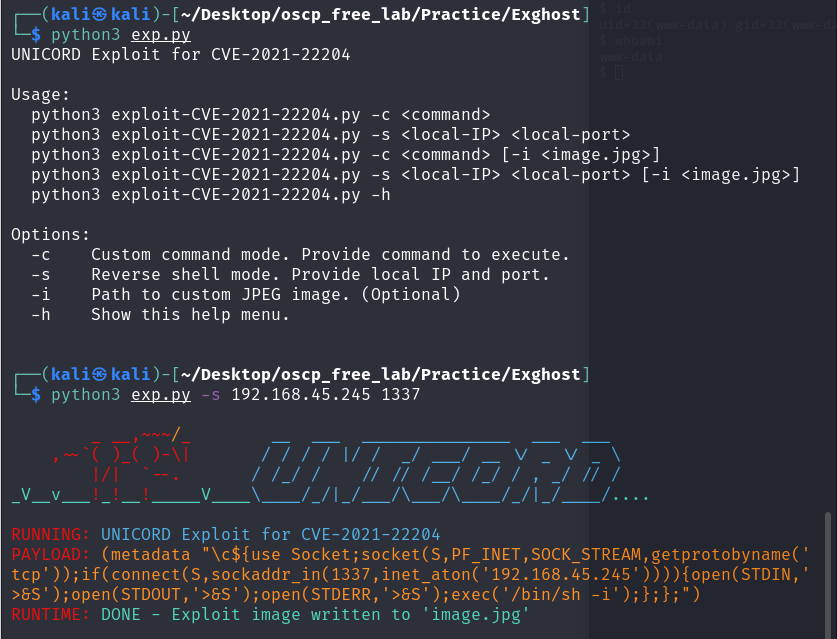

本系列為 Proving Grounds Play Subscription 靶機

## 官方難易度 : Easy

## 社群評論難易度 : Hard

## 解題花費時間 : < 120 min

## 知識點 : CVE-2021-22204, CVE-2021-4034

## Port Scan

## Port Scan

發現 `21,80` 

已知資訊, vsftpd 3.0.3, Apache httpd 2.4.41

### 80 Port

無發現 /cgi-bin/ 排除 CVE-2021-41773 目錄穿越

### Dirb 發現 uploads

### dirsearch

/`usr/share/wordlists/dirbuster/directory-list-2.3-medium.txt`

依然無結果

嘗試暴力破解 發現 FTP 中有成功爆出使用者

字典檔 `/usr/share/wordlists/legion/ftp-betterdefaultpasslist.txt` 

遇到出現

229 Entering Extended Passive Mode (|||6554|)

爬文後  輸入  epsv4 off , **再次出現 則輸入 passive**

發現 backup 資料夾 使用 get 下載

解析檔案發現為 pcap 封包檔案

 

使用wireshark 將封包載入,查看 80 port 發現有個 `exiftest.php`

顯示沒發現檔案上傳

回想一開始的目錄爆破,解出了uploads ,這應該是上傳點

封包中 翻到路徑 更加確定是從這邊上傳,

查看 http Header

發現`Content-Type : Multipart/form-data;`

建立一個上傳 html  上傳圖片顯示

上傳 revshell

---

最終 參考exiftool writeup 發現 封包那張圖已經顯示 `exiftool 12.23` 版本 找尋版本漏洞即可入侵

使用exp 將revshell 寫入 圖片,再進行上傳

# 提權

`sudo -l`

`find / -perm -4000 2>/dev/null`

折騰了許久 參考了Write up 發現檔案就在眼前

利用 CVE-2021-4034 進行題全,環境限制避免找.c檔案 因無法編譯

