本系列為 Proving Grounds Play Subscription 靶機

## 官方難易度 : Easy

## 社群評論難易度 :

## 解題花費時間 : < 120 min

## 知識點 :

## Port Scan

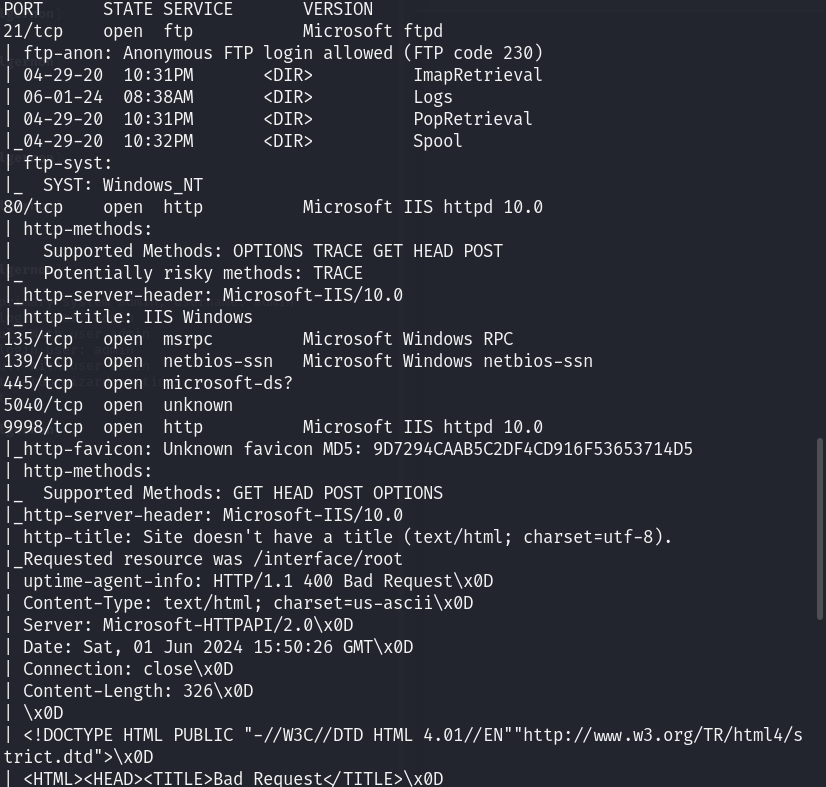

## 80 Port

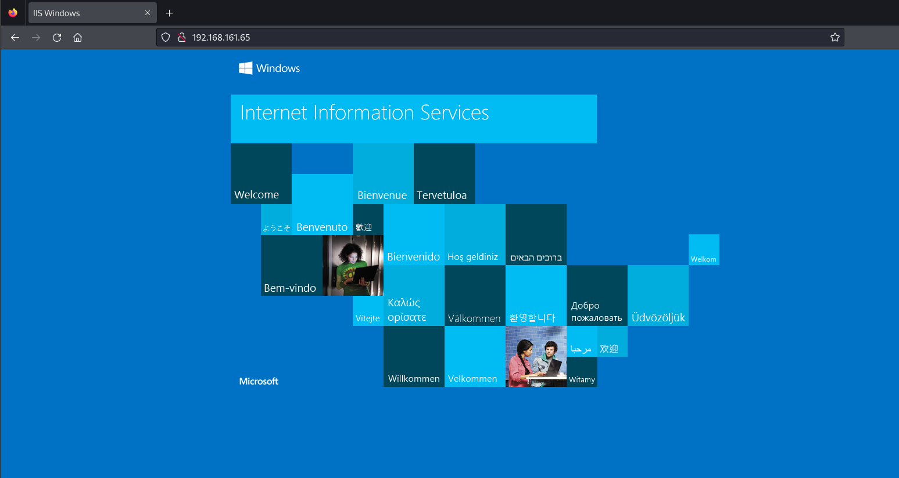

## 445 Port

smbclient Access_denied

enum4linux 沒東西

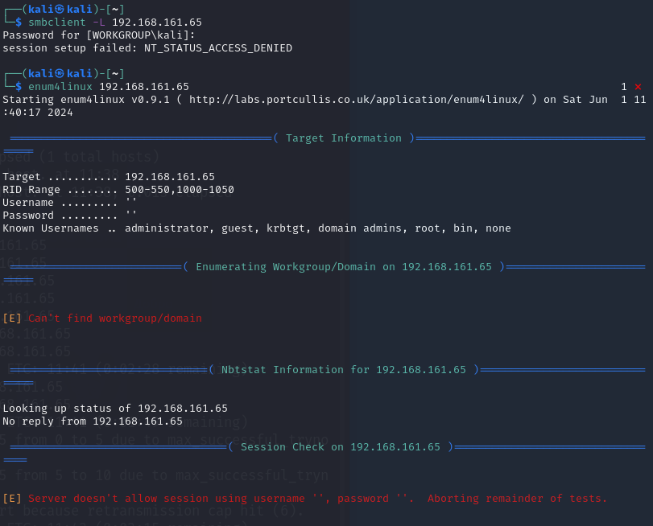

## 135 Port Connect ACCESS_DENIED

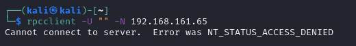

## 17001 Port

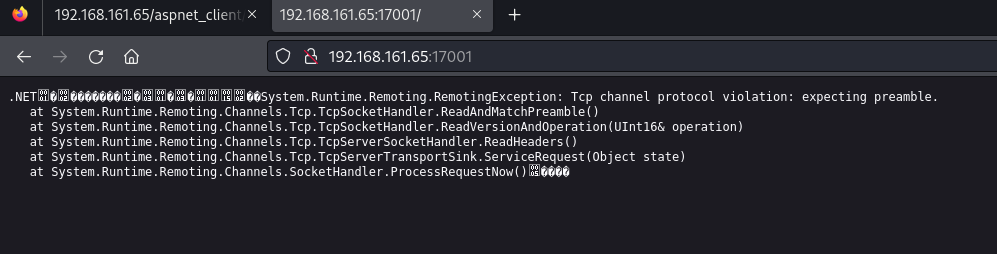

## 21  FTP 可匿名登入

帳號與密碼 anonymous

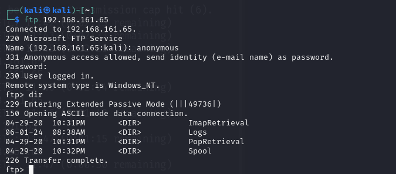

在logs裡面 發現 `2020.05.12-administrative.log`   

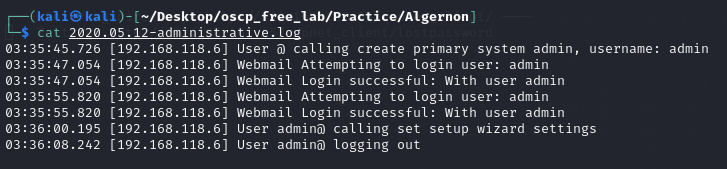

## 9998 Port

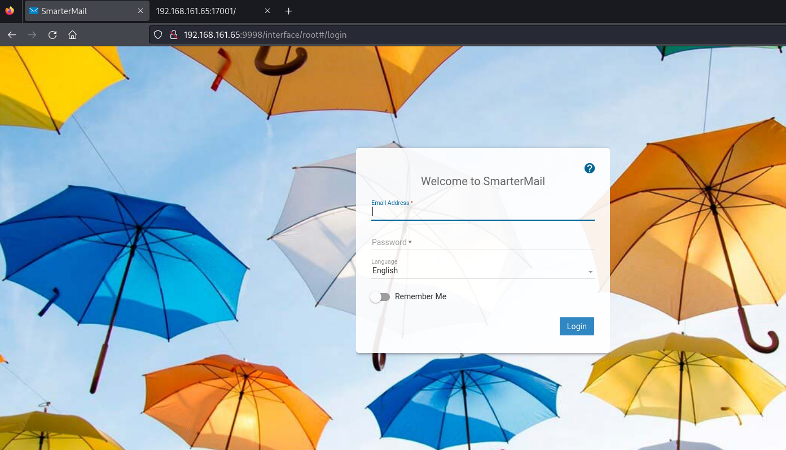

尋找 SmarterMail Exploit

使用 CVE-2019-7214 進去系統

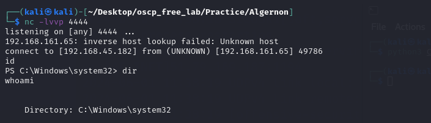

發現outpu.txt

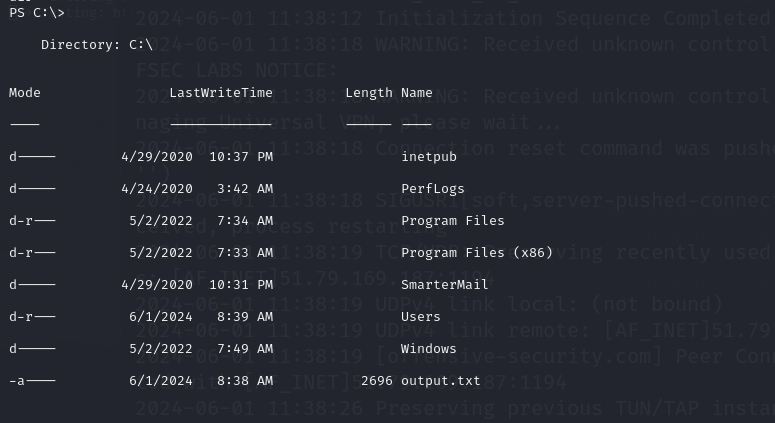

最高權限的桌面發現 proof.txt

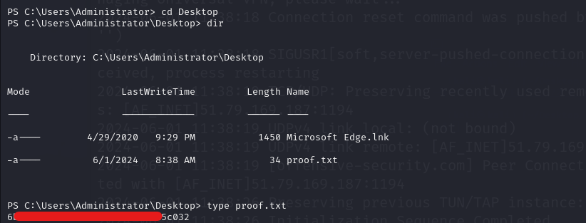