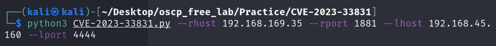
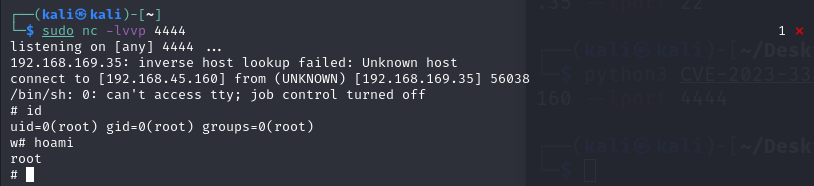

本系列為 Proving Grounds Play Subscription 靶機

紀錄花費時間 : < 30 min

### Port Scan

題目已說明 為 **CVE-2023-33831**

github 尋找一下相關的POC 可發現 固定Port 為1881 嘗試讀取

直接POC 上 RCE

[https://github.com/rodolfomarianocy/Unauthenticated-RCE-FUXA-CVE-2023-33831/blob/main/CVE-2023-33831.py](https://github.com/rodolfomarianocy/Unauthenticated-RCE-FUXA-CVE-2023-33831/blob/main/CVE-2023-33831.py)

